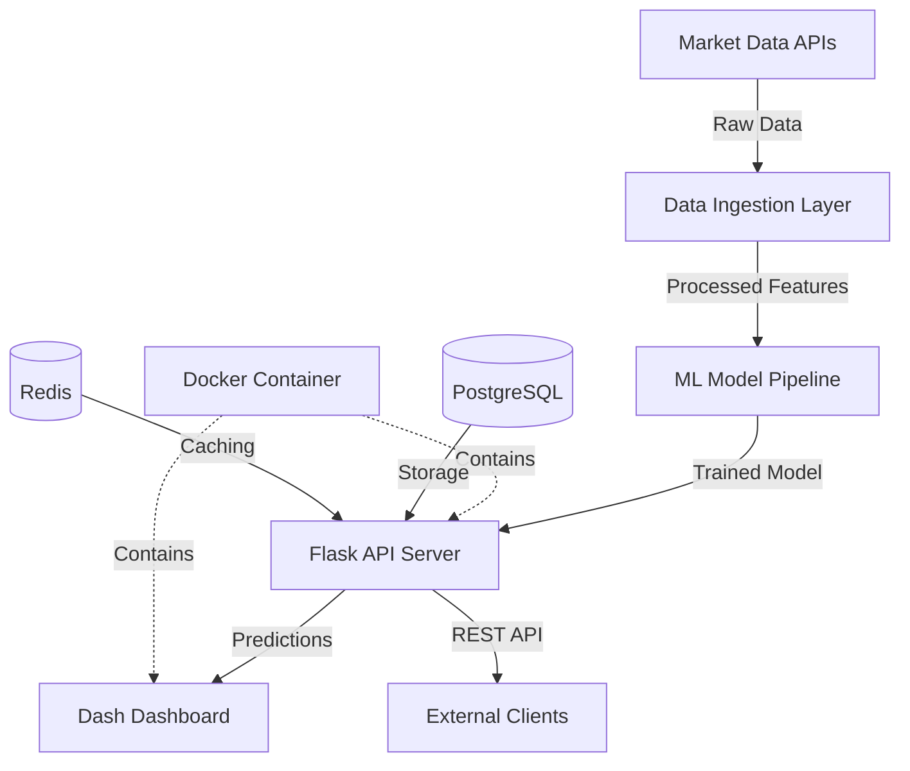

# VolatiQ: Production-Ready Quantitative Risk Intelligence Platform

[](https://github.com/yourusername/VolatiQ/actions)
[](https://hub.docker.com/r/yourusername/volatiq)
[](https://www.python.org/downloads/release/python-3110/)
[](https://opensource.org/licenses/MIT)

## 🚀 Overview

VolatiQ is a production-ready quantitative risk intelligence platform that forecasts short-term market volatility using advanced machine learning. Built with enterprise-grade architecture, it provides actionable insights for traders, risk managers, and financial analysts through a modern web interface and robust REST API.

### ✨ Key Features

- **🤖 Advanced ML Pipeline**: Deep neural networks with TensorFlow/Keras
- **🔍 Model Explainability**: SHAP-based feature attribution analysis
- **🌐 Production API**: Enterprise-grade Flask REST API with rate limiting
- **📊 Interactive Dashboard**: Modern Dash-based visualization interface
- **🐳 Containerized Deployment**: Docker & Docker Compose ready
- **⚡ High Performance**: Optimized for low-latency predictions
- **🔐 Secure & Scalable**: Input validation, error handling, and monitoring
- **📈 Real-time Insights**: Live market data integration capabilities

## 🏗️ Architecture



## 🏁 Quick Start

### Option 1: Docker Deployment (Recommended)

```bash
# Clone the repository
git clone https://github.com/yourusername/VolatiQ.git
cd VolatiQ

# Setup environment
cp env.example .env
# Edit .env with your configuration

# Deploy with Docker Compose
docker-compose up -d

# Verify deployment
curl http://localhost:5000/health
curl http://localhost:8050  # Dashboard
```

### Option 2: Local Development

```bash
# Setup virtual environment (Python 3.11 required)
python3.11 -m venv venv
source venv/bin/activate  # Windows: venv\Scripts\activate

# Install dependencies
pip install -r requirements.txt

# Train model (if needed)
python model/train.py


## 🛠️ Tech Stack

### Core Technologies
- **Python 3.11**: [[memory:5819218]] Primary development language
- **TensorFlow 2.16+**: Deep learning framework for volatility modeling
- **Flask 3.0+**: Production-ready API server with security features
- **Dash 3.2+**: Interactive web application framework

### Production Features
- **Docker & Docker Compose**: Containerized deployment
- **PostgreSQL**: Production database for data persistence
- **Redis**: Caching and session management
- **Gunicorn**: WSGI HTTP Server for production
- **Flask-Limiter**: API rate limiting and abuse prevention

### DevOps & Quality
- **GitHub Actions**: CI/CD pipeline with automated testing
- **Pytest**: Comprehensive test suite with coverage reporting
- **Black & Flake8**: Code formatting and linting
- **MyPy**: Static type checking
- **K6**: Performance and load testing

## 📁 Project Structure

```
VolatiQ/
├── api/                    # Flask REST API
│   └── app.py             # Main API application
├── dashboard/              # Dash web interface
│   ├── app.py             # Dashboard application
│   └── assets/            # CSS, JS, and static files
├── model/                  # ML model pipeline
│   ├── model.py           # Model architecture
│   ├── train.py           # Training pipeline
│   └── saved_model/       # Trained model artifacts
├── data/                   # Data storage and processing
│   ├── ingest.py          # Data ingestion utilities
│   └── market_data.csv    # Historical market data
├── tests/                  # Test suite
│   ├── test_api.py        # API endpoint tests
│   └── performance/       # Load and performance tests
├── .github/workflows/      # CI/CD pipelines
├── docker-compose.yml      # Multi-service deployment
├── Dockerfile             # Container configuration
├── config.py              # Application configuration
├── requirements.txt       # Python dependencies
├── DEPLOYMENT.md          # Deployment documentation
├── API_DOCUMENTATION.md   # API reference guide
└── env.example           # Environment configuration template
```

## 🔗 API Endpoints

| Endpoint | Method | Description | Rate Limit |
|----------|--------|-------------|------------|
| `/` | GET | API information and endpoints | 200/day |
| `/health` | GET | Health check and system status | 200/day |
| `/predict` | POST | Generate volatility predictions | 100/hour |
| `/explain` | POST | Get SHAP feature explanations | 50/hour |
| `/metrics` | GET | Model performance metrics | 200/day |

### Sample Prediction Request

```json
{
  "features": [
    [0.001, 0.02, 150.5, 149.8, 65.2]
  ]
}
```

### Sample Response

```json
{
  "predictions": [0.0234],
  "timestamp": "2024-01-15T10:30:00.000Z",
  "processing_time_seconds": 0.123,
  "model_version": "1.0.0",
  "num_predictions": 1
}
```

## 🚀 Deployment Options

### Cloud Platforms
- **AWS**: ECS, Lambda, or EC2 deployment ready
- **Google Cloud**: Cloud Run or GKE compatible
- **Azure**: Container Instances or AKS support
- **Heroku**: One-click deployment available

## 📊 Model Information

- **Architecture**: Deep Neural Network (128→64→32→1 neurons)
- **Features**: Log returns, volatility, moving averages, RSI
- **Target**: 5-day forward realized volatility
- **Framework**: TensorFlow/Keras with batch normalization
- **Training Data**: S&P 500 historical data (2015-2024)
- **Explainability**: SHAP kernel explainer integration

## 🔒 Security Features

- **Input Validation**: Comprehensive request validation
- **Rate Limiting**: API abuse prevention
- **Error Handling**: Secure error responses
- **Environment Isolation**: Container security
- **Secrets Management**: Environment variable configuration
- **HTTPS Ready**: TLS/SSL configuration support

## 📈 Performance

- **Prediction Latency**: <200ms for single predictions
- **Batch Processing**: Up to 1000 predictions per request
- **Throughput**: 100+ requests/hour per instance
- **Memory Usage**: <2GB RAM per container
- **Model Size**: <50MB for fast loading

## 🧪 Testing

```bash
# Run all tests
pytest tests/ -v

# Run with coverage
pytest tests/ --cov=. --cov-report=html

# Performance testing
k6 run tests/performance/load-test.js

# Security scanning
bandit -r api/ model/
```

## 📚 Documentation

- **[API Documentation](API_DOCUMENTATION.md)**: Complete REST API reference
- **[Deployment Guide](DEPLOYMENT.md)**: Production deployment instructions
- **[Contributing Guidelines](CONTRIBUTING.md)**: Development and contribution guide

## 🤝 Contributing

We welcome contributions! Please see [CONTRIBUTING.md](CONTRIBUTING.md) for guidelines.

1. Fork the repository
2. Create a feature branch (`git checkout -b feature/amazing-feature`)
3. Commit your changes (`git commit -m 'Add amazing feature'`)
4. Push to the branch (`git push origin feature/amazing-feature`)
5. Open a Pull Request


*Built with ❤️ for the finance and ML community*
